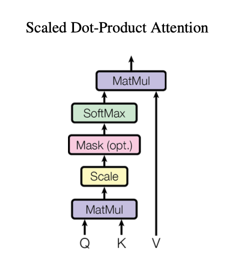
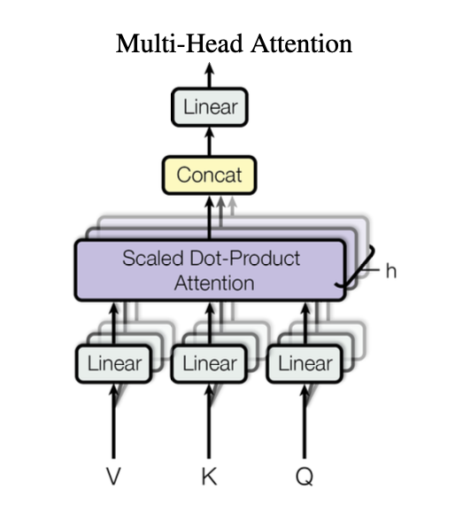

# attention mechanisms: an informal approach


if you are even vaguely familiar with the term "ChatGPT" chances are that you might have come across a term called **attention**. 

attention is what powers "transformers" - the seemingly complex architecture behind large language models (LLMs) like ChatGPT.

this blog attempts to take you through an informal approach of answering the question, "what does attention even mean?"


# some background first

before going deeper into the concept of attention, let me quickly tell you what the transformer architecture does in short. Don't worry, this will (maybe) feel like a breeze.

so...

a transformer has two main parts: 

- an encoder and 
- a decoder


### encoder's role
now, given some input *words* making an input sentence, the encoder is responsible for converting the plain-text input words into **tokens** where each token has a unique id associated with it AND is "represented" by a *high-dimensional vector*.

<br>

> wait, high-dimensional vector? why?

this is because, neural networks and hence machines do not understand text as us humans do, so we need to convert our text into something which neural networks understand very well that is... YES! a vector!

<br>

these vector "representations" capture a lot of information about the input words such as:

1. the word's semantic information
2. the word's positional information in the sentence
3. the word's "attention" with respect to other words in the sentence (this is what we will discuss in this blog btw)

condensing all this information into a matrix composed of high-dimensional token vectors is what the encoder does.

for example, a token representing the word "cat" will be encoded as

<div style="text-align: center">

</div>

a vector in some *n-dimensional space*

<br>

> semantic information? positional information? ahhh, i don't understand

hey don't worry...

here i'm shamelessly skipping the fine-details of how the plain-text words are converted into these vector "embeddings" that capture the semantic (1st point) and positional (2nd point) information, since our focus is mainly on attention today. [Word embeddings](https://en.wikipedia.org/wiki/Word_embedding) can be a whole topic in itself. But, for now, imagine using magic we convert words into some vector "embeddings".

_insert manim of word + positional embeddings_

### decoder's role

to be honest, a decoder is kind of similar to an encoder. 

during the model training phase, it also takes a sequence of words, similar to an encoder, which are the **targets** and converts them into vector representations or embeddings similar to the output of an encoder.

BUT...

in the decoder, attention is calculated in a slightly different way than the encoder.

essentially,

- an encoder calculates **self-attention** while,
- a decoder calculates **masked self-attention** and then **encoder-decoder attention**

<br>

> bruh, what are those words surrounding attention?

i know, i know you are lost and honestly i was too but self-attention, masked self-attention, and encoder-decoder attention are **attention mechanisms** which we will go through today.

<br>

for simplicity just know that the encoder provides the decoder with some embeddings, and decoder _uses_ those embeddings (along with its own embeddings) to generate an output token, one at a time.


### architecture

a diagram of the original transformer architecture will be helpful here:


have a good look at this... it is taken from the paper [Attention is all you need](https://arxiv.org/abs/1706.03762) which first introduced the concept of transformers.

the diagram is a bit cryptic but the block on the left with two sub-parts is the encoder and the block on the right with three sub-parts is the decoder.

there are arrows flowing from the encoder to the decoder which are just the "representations" of the inputs whose attention is calculated with the partial "representations" of the decoder (2nd sub-part from the bottom inside the decoder)


# attention: the juicy part

while reading this paragraph you are involuntarily focussing and "attending" to some particular words MORE than other words.

this helps your human (if you are one) brain to form complex relationships between the words even when they are far apart within a paragraph. Since you are attentive, you implicitly know which words are more "useful" and which words are not that "useful" in this sentence.

the intuition behind **attention** in transformers is analogous to this.

what attention aims to do is: it calculates a "score" which we can call the **usefulness score** for each token with other tokens of two different sentences OR even the same sentence (self-attention).

after this, the initial vector representations of the tokens are transformed into final vector representations based on the **usefulness score**, hoping that it captures the usefulness information i.e. which tokens to "attend" to and which tokens are more "useful".

<br>

> can i use a "word" instead of a "token" in order to think in a simple manner?

yes for simplicity you can think of a token as a word but in more general sense, a word can/cannot be made up of two or more tokens for example:

- `cat -> cat` (word is itself a token)
- `don't -> don + ' + t` (word is composed of several tokens)

<br>

### self-attention and encoder-decoder attention

using the above intuition of the usefulness score of tokens, we can think about what **self-attention** is and what **encoder-decoder attention** is.

- in self-attention, the usefulness scores are calculated between the tokens of one sentence (representations), and the tokens of the SAME sentence (same representations).

_insert manim of same sentence attention_

- in encoder-decoder attention, the usefulness scores are calculated between the encoder representations, and the decoder representations i.e. the sentences will be different here.

_insert manim of different sentence attention_

# queries, keys, and values

ok, now that i have loosely explained the intuition behind attention, let's think of how this thing is calculated.

imagine you had two vector "representations" or vectors in short:

<div style="text-align: center">

</div>

and,

<div style="text-align: center">

</div>

in some n-dimensional vector space, then we can calculate the similarity between the two vectors using their [dot product](https://en.wikipedia.org/wiki/Dot_product) which is:

<div style="text-align: center">

</div>

since we represent tokens (or words) using their vector representations, the value of the dot product will tell us how similar those tokens are in their _embeddings vector space_.

the original paper [Attention is all you need](https://arxiv.org/abs/1706.03762) converts each token's vector representation into three more vectors called **Query**, **Key**, and **Value**.

each token has its query vector, key vector, and value vector

<br>

> but why do they add three more vectors? why query, key, and value? why not something else?

good! you are asking the right questions. Essentially, the usage of Query, Key, and Value and hence attention, is hugely analogous to **retrieval systems**. And the calculation of **attention** is done using these three vectors.

okay...

consider we have a database having some keys and their corresponding values. Imagine the database to represent some knowledge where the keys are "topics" and the values are the "information" we need about the corresponding "topic". 

<div style="text-align: center">

</div>


Now you as a user wants to query the database to fetch some important "information" (**V**) based on your "query" (**Q**).

in order to do that, we need to find which "topics" (**K**) in the database are similar to your "query" (**Q**)

once we find the "topics" (**K**) that are similar to your "query" (**Q**) we can sort them according to their relevance and then process their corresponding "information" (**V**).

<br>

> oh! i see a pattern here... so if i have two sentences and i want to find the "usefulness" or "attention" of one word in the first sentence with respect to the words of the second sentence, we can create a "query" out of that one word. We can also create "keys" and "values" for every other word in the second sentence, in order to find the usefulness, which is very similar to retrieval systems! damn.

bingo! i presume that's why the original transformers paper introduce the three vectors Query, Key, and Value for each token.

<br>

consider we have a sentence made up of tokens:

<div style="text-align: center">

</div>

<div style="text-align: center">

</div>

where each token is represented using a vector in some m-dimensional vector space. From the vector representation of each token, we create the query, key, and value vector:

<div style="text-align: center">

</div>

<br>

note: here the dimension of the query and the key vectors is equal to some value _k_, while the dimension of the value vector is equal to some value _v_.

the imaginary tokens database for the second sentence (having `z` tokens) now looks like:

<div style="text-align: center">

</div>

if we want to calculate the attention of the first token of the first sentence with respect to all the tokens of the second sentence, we create the query **Q** for the first token as:

<div style="text-align: center">

</div>

<br>

now, from the above intuition of retrieval systems:

1. **find similarity between Query and Keys**
    since the query and keys are vectors, we can find the similarity using their corresponding dot products to know which "topics" (keys) are more similar to our query. This gives us:

    <br>

    <div style="text-align: center">
    
    </div>

    <br>

2. **"sort" the Keys**
    after calculating the dot product between the query and the keys, we get the vector of "similarity scores" between the different keys and our query:

    <div style="text-align: center">
    
    </div>

    in order to "sort" them i.e. to find the weightage of which keys are the most useful, we can pass the above vector to a [softmax function](https://en.wikipedia.org/wiki/Softmax_function):

    <br>

    <div style="text-align: center">
    
    </div>

    <div style="text-align: center">
    
    </div>

    <br>

3. **get final representations using Values**
    we now have the weightage of which keys (tokens) are the most useful in the second sentence with respect to our query. To get the "attention" of our query, we can simply multiply the above softmax output (which is a vector of dimension `z`) with the `z` values.

    thus:

    <br>

    <div style="text-align: center">
    
    </div>

    here the vector `[y1, y2, ..., yz]` is the result of the softmax function over the vector **x**.

    this gives us the "attention": vector representation for the query (first token) with respect to the tokens in the second sentence!

<br>

now that we have an understanding of attention for one token with respect to a different sentence or even the same sentence, let me give the formal definition of attention from the original paper [Attention is all you need](https://arxiv.org/abs/1706.03762):

> An attention function can be described as mapping a query and a set of key-value pairs to an output, where the query, keys, values, and output are all vectors. The output is computed as a weighted sum of the values, where the weight assigned to each value is computed by a compatibility function of the query with the corresponding key.

think about it... so much information condensed in this one single definition!

<br>

if we want to calculate attention of all tokens of one sentence with respect to all tokens of the second sentence, we can replace the query, key, and value vectors with **matrices**:

<br>

<div style="text-align: center">

</div>

<br>

we can now express dot products between the queries and the keys in the form of matrix multiplication; product of the query matrix with the transpose of the key matrix.

the calculation of attention then becomes:

<div style="text-align: center">

</div>

with appropriate matrices for query, keys, and values.

however, the paper also introduces a "scaling term" in order to keep the [problem of exploding/vanishing gradients](https://www.comet.com/site/blog/vanishing-exploding-gradients-in-deep-neural-networks/) during backpropagation under control. The scaling term is taken to be equal to the square root of the dimension of query and key vectors i.e. the square root of value `k`.

thus our final equation for "self-attention" becomes:

<div style="text-align: center">

</div>

phew! that was a lot to uncover.

here's how the shapes of the matrices fit in the above equation:

```python
# consider self-attention, ignore scaling term
# initial vector U of size (n, m)

Q = (n, k)
K = (n, k)
V = (n, v)

Q * K.T = (n, k) * (k, m) = (n, m)

softmax(Q * K.T) = (n, m)

softmax(Q * K.T) * V = (n, m) * (m, v) = (n, v)

# final representations have the shape (n, v)
```

finally, the below figure will help you visualize how attention is calculated:




# masked self-attention

once you understand what self-attention is, the concept of masked self-attention will feel like a walk in the park.

basically...

self-attention calculates the attention of a particular token with respect to all the other tokens (including itself) in the same sentence.

masked self-attention, on the other hand, calculates the attention of a particular token with respect to all the tokens **preceding** it (including itself) in the same sentence. Which means, the tokens that come after that one particular token are "masked" i.e. the attention with them is not calculated.

<br>

> if i remember correctly, the encoder calculates self-attention and the decoder calculates masked self-attention right?

yes, this is because the decoder is responsible for "predicting" which token **could** come next after encountering a particular token. Also, to limit the decoder to not foresee the future tokens already, it calculates masked self-attention rather than self-attention.


# multi-head attention

we discussed about the query, keys, and values vectors, but you might have a question about how do we convert our initial vector representations to these vectors.

it's simple...

we multiply the initial vector representations with weight matrices to get the query, key, and values vectors respectively. You can think of these weights as the weights of a simple feed-forward neural network layer (without adding any `bias`). So, in terms of pytorch:

```python
import torch.nn as nn

# define the dimensions n, m, k, and v
# initial vector of size (n, m)

WQ = nn.Linear(m, k, bias = False)
WK = nn.Linear(m, k, bias = False)
WV = nn.Linear(m, v, bias = False)
```

in the previous sections, we calculated the attention of tokens with only one Query, and only one Key-Value pairs

the authors of the original transformers paper proposed that we can have different **heads** of attention, where each head has its own Query, and Key-Value pairs which are derived from the original query, and key-value matrices.

so in this method, the authors multiply the original query, and key-value pairs again with `h` different weight matrices `WQ'`, `WK'`, and `WV'` with appropriate dimensions to get `h` different Query, and Key-Value pairs.

adding more **heads** can be beneficial if we want to find which tokens to attend in different representation subspaces. As described in the paper:

> Multi-head attention allows the model to jointly attend to information from different representation subspaces at different positions.

the attention (as explained above) is calculated for these `h` different queries, keys and value the output of which, is then concatenated in the end to form a matrix of shape `(n, h * v)`.

the output of the concatenation is also passed through a weight matrix `WO` of shape `(h * v, m)` to get the final output vector representations.

so the calculation for multi-head attention is:

<div style="text-align: center">

</div>

where,

<div style="text-align: center">

</div>

here the term "attention" is the scaled dot-product attention which i explained above and the weight matrices `WQ`, `WK`, and `WV` are the learnable parameters for each head.

the resulting output vector representations captures the multi-head attention information within them which are then processed further.

finally, the figure below visualizes what multi-head attention does:




# conclusion

*exhales*

okay... that was a lot to take but hopefully now you have some intuition behind the concept of attention mechanisms in transformers which powers the large language models (LLMs) like ChatGPT.

do note that, there can be several forms of attention which might provide "better" results such as [sliding window attention](https://paperswithcode.com/method/sliding-window-attention), but my intention behind this blog post was to approach the concept of transformers attention is a very informal yet intuitive manner.

thank you for reading this anon, see you very soon!


# references

links of the materials that helped me A LOT in order to write this blog post:

- [Attention is all you need](https://arxiv.org/abs/1706.03762) paper

- [stats stackexchange thread](https://stats.stackexchange.com/questions/421935/what-exactly-are-keys-queries-and-values-in-attention-mechanisms)

- [LLaMA explained: KV-Cache, Rotary Positional Embedding, RMS Norm, Grouped Query Attention, SwiGLU](https://youtu.be/Mn_9W1nCFLo?si=qsLQPIbW25Og_uMU) YouTube video

- [insert link to my brain lol]
