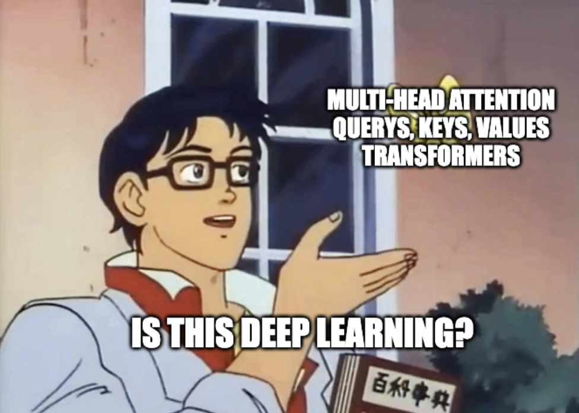

# attention mechanisms: an informal approach

if you are even vaguely familiar with the term "ChatGPT" chances are that you might have come across a term called **attention**. 

attention is what powers "transformers" - the seemingly complex architecture behind large language models (LLMs) like ChatGPT.

this blog attempts to take you through an informal approach of answering the question, "what the hell does attention even mean?"
