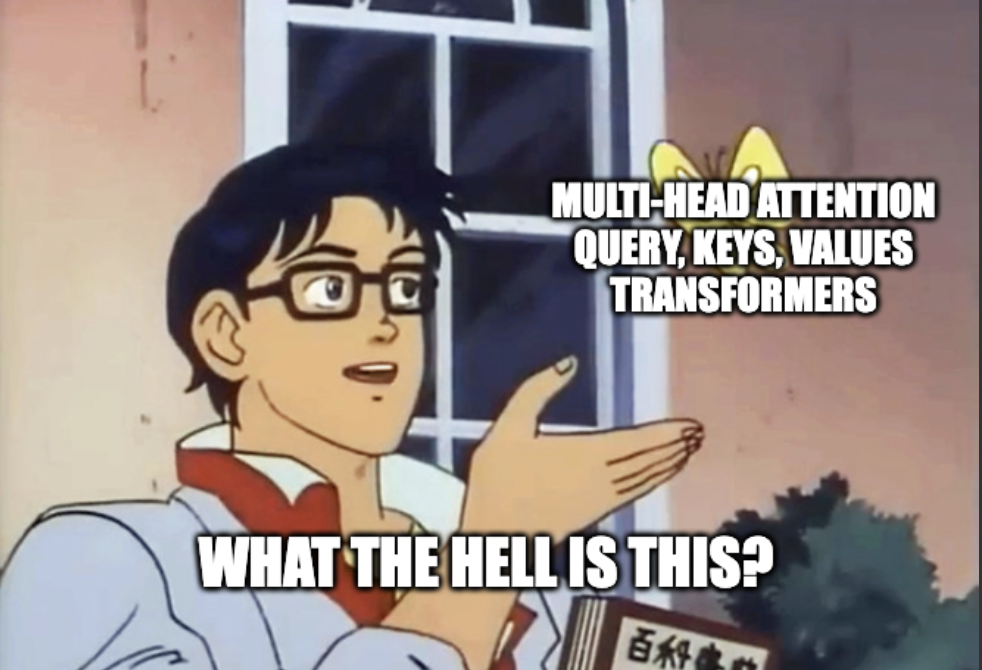
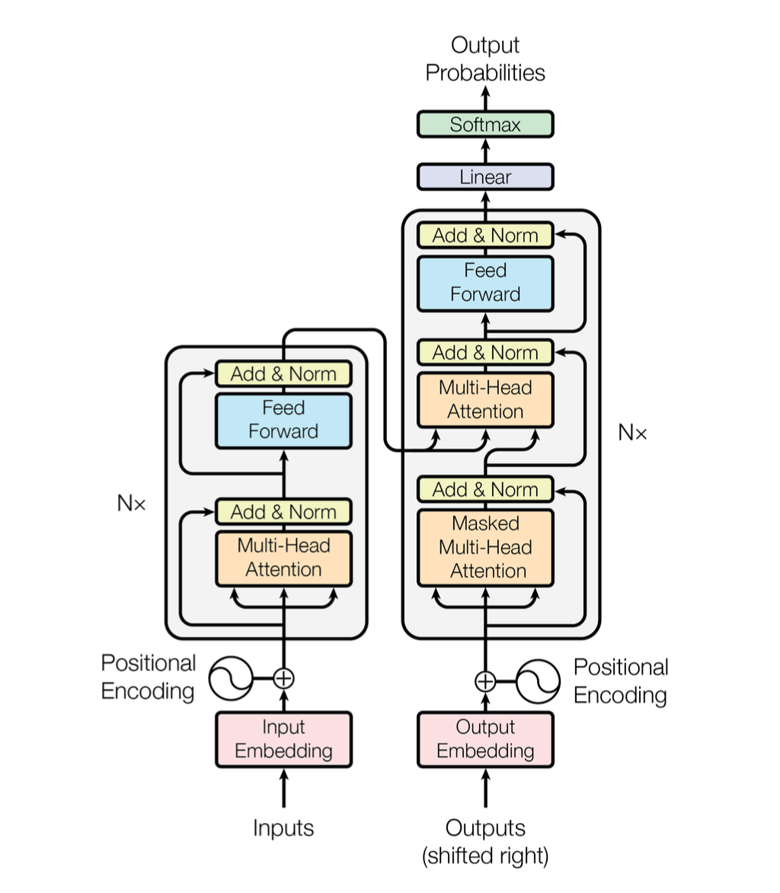

# attention mechanisms: an informal approach

if you are even vaguely familiar with the term "ChatGPT" chances are that you might have come across a term called **attention**. 

attention is what powers "transformers" - the seemingly complex architecture behind large language models (LLMs) like ChatGPT.

this blog attempts to take you through an informal approach of answering the question, "what the hell does attention even mean?"

# some background first

before going deeper into the concept of attention, let me quickly tell you what the transformer architecture does in short. Don't worry, this will (maybe) feel like a breeze.

so...

a transformer has two main parts: 

- an encoder and 
- a decoder

### encoder's role
now, given some input *words* making an input sentence, the encoder is responsible for converting the plain-text input words into **tokens** where each token has a unique id associated with it AND is "represented" by a *high-dimensional vector*.
 
> wait, high-dimensional vector? why?

this is because, neural networks and hence machines do not understand text as us humans do, so we need to convert our text into something which neural networks understand very well that is... YES! a vector!

 
these vector "representations" capture a lot of information about the input words such as:

1. the word's semantic information
2. the word's positional information in the sentence
3. the word's "attention" with respect to other words in the sentence (this is what we will discuss in this blog btw)

condensing all this information into a matrix composed of high-dimensional token vectors is what the encoder does.

for example, a token representing the word "cat" will be encoded as

a vector in some *n-dimensional space*

 

> semantic information? positional information? ahhh, i don't understand

hey don't worry...

here i'm shamelessly skipping the fine-details of how the plain-text words are converted into these vector "embeddings" that capture the semantic (1st point) and positional (2nd point) information, since our focus is mainly on attention today. [Word embeddings](https://en.wikipedia.org/wiki/Word_embedding) can be a whole topic in itself. But, for now, imagine using magic we convert words into some vector "embeddings".

_insert manim of word + positional embeddings_

### decoder's role

to be honest, a decoder is kind of similar to an encoder. 

during the model training phase, it also takes a sequence of words, similar to an encoder, which are the **targets** and converts them into vector representations or embeddings similar to the output of an encoder.

BUT...

in the decoder, attention is calculated in a slightly different way than the encoder.

essentially,

- an encoder calculates **self-attention** while,
- a decoder calculates **masked self-attention** and then **encoder-decoder attention**

 

> bruh, what are those words surrounding attention?

i know, i know you are lost and honestly i was too but self-attention, masked self-attention, and encoder-decoder attention are **attention mechanisms** which we will go through today.

 

for simplicity just know that the encoder provides the decoder with some embeddings, and decoder _uses_ those embeddings (along with its own embeddings) to generate an output token, one at a time.

### architecture

a diagram of the original transformer architecture will be helpful here:

have a good look at this... it is taken from the original [Attention is all you need](https://arxiv.org/abs/1706.03762) paper which first introduced the concept of transformers.

the diagram is a bit cryptic but the block on the left with two sub-parts is the encoder and the block on the right with three sub-parts is the decoder.

there are arrows flowing from the encoder to the decoder which are just the "representations" of the inputs whose attention is calculated with the partial "representations" of the decoder (2nd sub-part from the bottom inside the decoder)

# attention: the juicy part

while reading this paragraph you are involuntarily focussing and "attending" to some particular words MORE than other words.

this helps your human (if you are one) brain to form complex relationships between the words even when they are far apart within a paragraph. Since you are attentive, you implicitly know which words are more "useful" and which words are not that "useful" in this sentence.

the intuition behind **attention** in transformers is analogous to this.

what attention aims to do is: it calculates a "score" which we can call the **usefulness score** for each token with other tokens of two different sentences OR even the same sentence (self-attention).

_insert manim of attention between two sentences and same sentence_

after this, the initial vector representations of the tokens are transformed into final vector representations based on the **usefulness score**, hoping that it captures the usefulness information i.e. which tokens to "attend" to and which tokens are more "useful".

 

> can i use a "word" instead of a "token" in order to think in a simple manner?

yes for simplicity you can think of a token as a word but in more general sense, a word can/cannot be made up of two or more tokens for example:

- `cat -> cat` (word is itself a token)
- `don't -> don + ' + t` (word is composed of several tokens)

 

### self-attention and encoder-decoder attention

using the above intuition of the usefulness score of tokens, we can think about what **self-attention** is and what **encoder-decoder attention** is.

- in self-attention, the usefulness scores are calculated between the tokens of one sentence (representations), and the tokens of the SAME sentence (same representations).

_insert manim of same sentence attention_

- in encoder-decoder attention, the usefulness scores are calculated between the encoder representations, and the decoder representations i.e. the sentences will be different here.

_insert manim of different sentence attention_

# queries, keys, and values